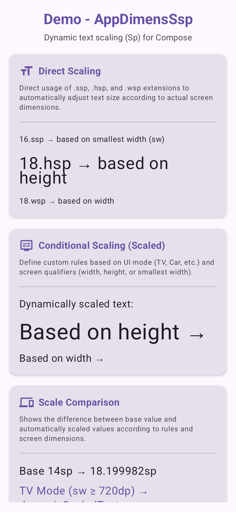
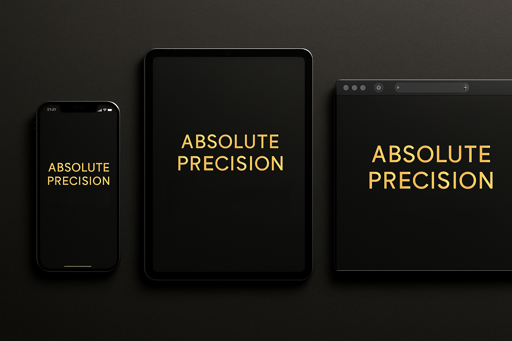

# AppDimens SSP, HSP, WSP


Welcome to the official documentation for the **AppDimens SSPS** library.

## 📖 What is this library?

**AppDimens SSP, HSP, WSP** is a modern dimension management system exclusively for typography and fonts (`Sp`) on Android. It expands the classic SSP (Scaled Size Pixels) standard by introducing scaling by Height (HSP) and Width (WSP). The library automates the process of adjusting text sizes (`TextUnit`), ensuring that typography remains perfectly scaled and legible on any device format in a mathematically precise way.

## ✨ What's New in 3.0.0

* **Foldable Device Support (`FoldingFeature`):** Seamless integration with Jetpack WindowManager to detect half-opened/closed states of Folds and Flips, adapting text sizes dynamically.
* **Orientation Inverters (`Inverter`):** New powerful extensions like `.hsp_lw`, `.wsp_ph`, `.hem_pw` to dynamically flip layout dimensions and font scaling behaviors based on Landscape or Portrait orientations.
* **Advanced `Scaled` Builder:** More granular conditional scaling using `DpQualifier`, `Orientation`, `Inverter`, and font scaling preferences.

## ⚙️ What does it do?

It provides thousands of pre-calculated `@dimen` resources (from `1` to `600`) ready to use, saving the developer the trouble of calculating font sizes for each Android screen variant.

* **SSP (Smallest Width SP):** Scales the font based on the device's smallest width available. Perfect for maintaining text proportions in most scenarios (e.g., `@dimen/_16ssp` or `16.ssp`).
* **WSP (Width SP):** Scales text specifically based on the device's exact horizontal width in the current orientation (e.g., `@dimen/_16wsp` or `16.wsp`).
* **HSP (Height SP):** Scales text specifically based on the device's exact vertical height (e.g., `@dimen/_16hsp` or `16.hsp`).
* **SEM, WEM, HEM (Ignore Font Scale):** The `.sem`, `.wem`, `.hem` variants work the same way as the standard SSP/WSP/HSP resources but **do not follow the system's accessibility font scale settings**. They are useful for texts that shouldn't break strict component designs regardless of user accessibility preferences.
* **Dynamic Conditionals (Compose):** Facilitates adapting the font based on the device type (Car, TV, Watch), orientation, qualifiers, and more through the `.scaledSp()` instruction.
* **Inverters:** Added inverted variants like `.wsp_lh` (Width SP that acts as Height SP in Landscape) to maintain proportional designs upon screen rotation.

<br/>
<p align="center">
  
</p>
<br/>

## 🚀 Advantages

1. **Accelerated Development:** Eliminates the need to create massive manual `dimens.xml` files for various screen categories (like `values-sw320dp`, `values-sw600dp`). Everything comes unified.
2. **Direct Hybrid Integration:** Works incredibly well both in traditional **XML** (`View System`) through predefined dimensions, and in the modern era of **Jetpack Compose**.
3. **Flexible Scaling:** Allows customizing typography by controlling whether Android's user accessibility scales should affect certain texts or not, through `.ssp` (which respects it) vs `.sem` (which ignores user scaling).
4. **Precision for TV, Wear OS, and Auto:** Handles advanced font rules without complexity using `UiModeType` combined with qualifiers.

## ⚡ Performance

The implementation ensures zero or virtually zero impact on performance:
* **In XML:** All tags like `@dimen/_16ssp` are processed statically at build time and resolved natively and parallel to the Android Framework resources.
* **In Compose:** Access to `.ssp`, `.hsp`, and `.wsp` uses optimized functions that extract dimensions via native context caching (`LocalConfiguration`, `LocalDensity`, and injected IDs). Avoiding unnecessary processing, it respects conventional UI steps without forcing useless recompositions.

## 🛠️ Support and Installation

The library has broad support in the Android ecosystem and is constantly updated for the most recently launched paradigms.

* **Min SDK:** 24
* **Compile SDK:** 36
* **Languages:** Kotlin and Java.
* **Paradigm:** XML and Jetpack Compose.

To install, simply add it to your `build.gradle` (dependency):

```kotlin
dependencies {
    implementation("io.github.bodenberg:appdimens-ssps:3.0.6")
}
```

### Quick Example in XML Layouts:
```xml
<TextView
    android:layout_width="wrap_content"
    android:layout_height="wrap_content"
    android:text="Responsive SSP Size"
    android:textSize="@dimen/_24ssp" />

<TextView
    android:layout_width="wrap_content"
    android:layout_height="wrap_content"
    android:text="Width Scaled WSP Size"
    android:textSize="@dimen/_16wsp" />
```

### Quick Example in Compose:
```kotlin
Text(
    text = "Responsive Sizing",
    fontSize = 24.ssp, // Scales font based on Smallest Width and respects system font scale
    lineHeight = 28.ssp
)

Text(
    text = "Restricted Text Size",
    fontSize = 16.sem // Scales based on Smallest Width, but is NOT affected by vision accessibility preference
)

Text(
    text = "Orientation Responsive Sizing",
    fontSize = 20.wsp_lh // Acts as Width SP in Portrait, but switches to Height SP in Landscape
)
```

### Advanced Conditional Example (Compose):
```kotlin
// Scales according to device type, folding features, orientation, or custom qualifiers
val dynamicFontSize = 16.sp.scaledSp()
    // Specifically on TV, it will be 32.ssp
    .screen(UiModeType.TELEVISION, customValue = 32.ssp)
    // On Landscape orientation, use 20.wsp
    .screen(orientation = Orientation.LANDSCAPE, customValue = 20.wsp)
    // On devices with Smallest Width >= 600dp, use 24.ssp
    .screen(DpQualifier.SMALL_WIDTH, 600, customValue = 24.ssp)
    .ssp // Default fallback is 16.ssp
```



---
*Created with the best practices for responsive and accessible layouts for the Android ecosystem.*
